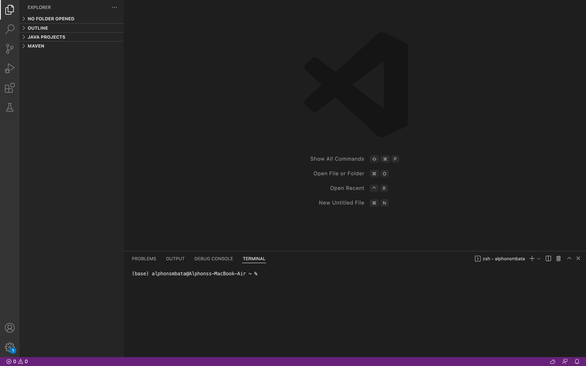
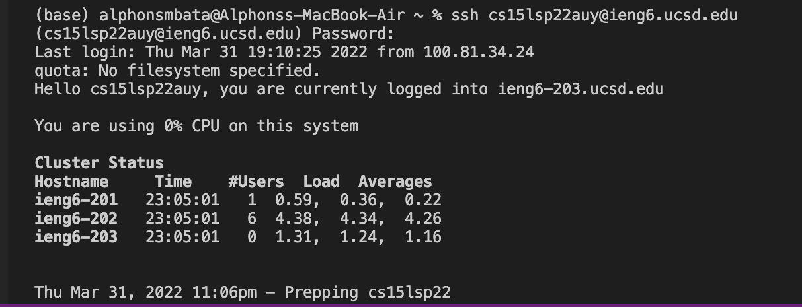
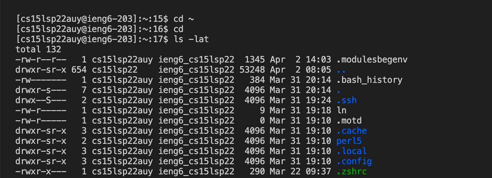
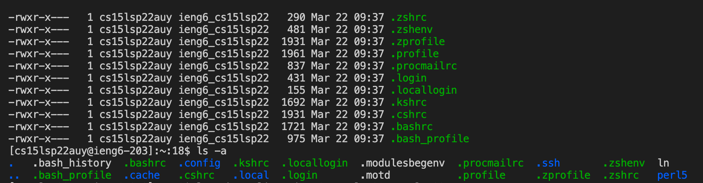
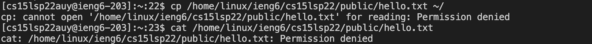
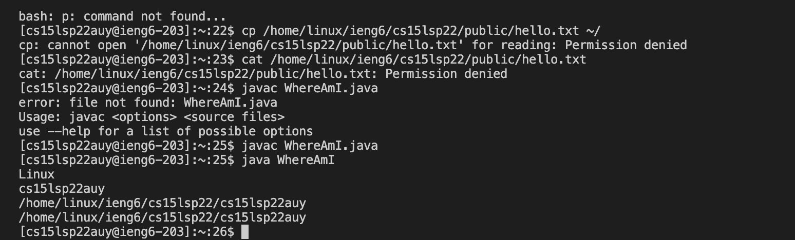
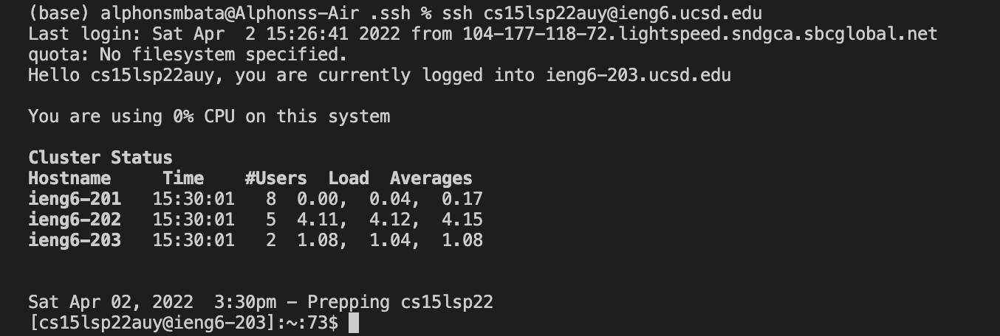

# Lab Report 1

Here is a tutorial for incoming 15L students on how to log into a course-specific account on ***ieng6***.

Below are the steps needed for account set-up followed by screenshots depicting what is expected while following along.

**Account Set-Up: Steps**

1. Installing VScode

    - Visit the **Visual Studio Code** website at this link: https://code.visualstudio.com/
    
    - Downlaod and install **Visual Studio Code** onto your computer depending on your type.

    - Once you are done installing it onto your computer you should open the application and be met with your screen like so:

    

2. Remotely Connecting

    - Open a new terminal in VSCode and type in 
    
        *ssh cs15lsp22zz@ieng6.ucsd.edu*

        where zz is replaced by the letters in your specific account name.

    - After typing that in you will be asked if you would like to continue connecting to which you should type, ***yes***.

    - You will then be prompted to enter your *ieng6* account password, which upon entry should result in your screen looking like so:

    

3. Trying Some Commands

    - Next you should try running these specific commands in the terminal.

    - cd ~

    - cd

    - ls -lat

    - ls -a

    - ls <*directory*> where <*directory*> is 
    
        */home/linux/ieng6/cs15lsp22/cs15lsp22abc*
        
        here the abc is your username.

    - cp /home/linux/ieng6/cs15lsp22/public/hello.txt ~/

    -  cat /home/linux/ieng6/cs15lsp22/public/hello.txt

    - The resulting image should look like this:

    
    
    

4. Moving Files with scp

    - Here is how to move files from a local computer to a remote computer.

    - Log out of your *ieng6* account by typing in logout. In the terminal run the command:

        ***scp** WhereAmI.java cs15lsp22zz@ieng6.ucsd.edu:~/*
    
        where **zz** is the three letter to your specific account name and **WhereAmI.java** is any working file.
        
    - You will be prompted for your password which you will then enter. Log into your *ieng6* account again and run the command ***ls***. This should show the file in the home directory now and you can run it on your *ieng6* accont using javac and java. Result should look like so:

    

5. Setting an SSH Key

    - On your local computer (not *ieng6*), enter 
    
        ***ssh-keygen***

    - Enter the file in which to save the key
    
        ***/Users/user-name/.ssh/id_rsa***

        (replace user-name with your computer username in these brackets " <> ")

    - You will be prompted to enter a passphrase twice but you should press enter both times. The result should be your keys' randomart. You now have a private and public key stored in your directory.

    - Copy the public key to the directory of your user account on the server by logging into your *ieng6* account and typing this into the terminal:

        ***mkdir .ssh***

    - Log out of your *ieng6* account and on the client type out

        *scp /Users/user-name/.ssh/id_rsa.pub*

        *cs15lsp22zz@ieng6.ucsd.edu:~/.ssh/authorized_keys*

        (replace user-name with your computer username in these brackets " <> ")

        Now ssh-ing or scp-ing with your account should be possible as seen in this screenshot without having to type in your password.

    

6. Optimizing Remote Running