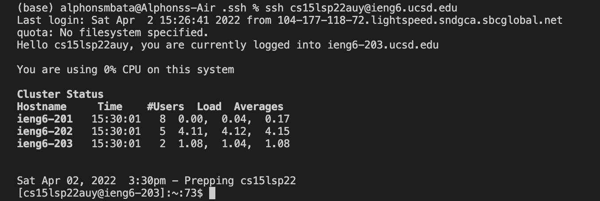

# Lab Report 1

Here is a tutorial for incoming 15L students on how to log into a course-specific account on ***ieng6***.

Below are the steps needed for account set-up followed by screenshots depicting what is expected while following along.

**Account Set-Up: Steps**

1. Installing VScode

    - Visit the **Visual Studio Code** website at this link: https://code.visualstudio.com/
    
    - Downlaod and install **Visual Studio Code** onto your computer depending on your type.

    - Once you are done installing it onto your computer you should open the application and be met with your screen like so:

    

2. Remotely Connecting

    - Open a new terminal in VSCode and type in * ssh cs15lsp22zz@ieng6.ucsd.edu*, where zz is replaced by the letters in your specific account name.
    - After typing that in you will be asked if you would like to continue connecting to which you should type, ***yes***.
    - You will then be prompted to enter your *ieng6* account password, which upon entry should result in your screen looking like so:

    

3. Trying Some Commands

4. Moving Files with scp

5. Setting an SSH Key

6. Optimizing Remote Running